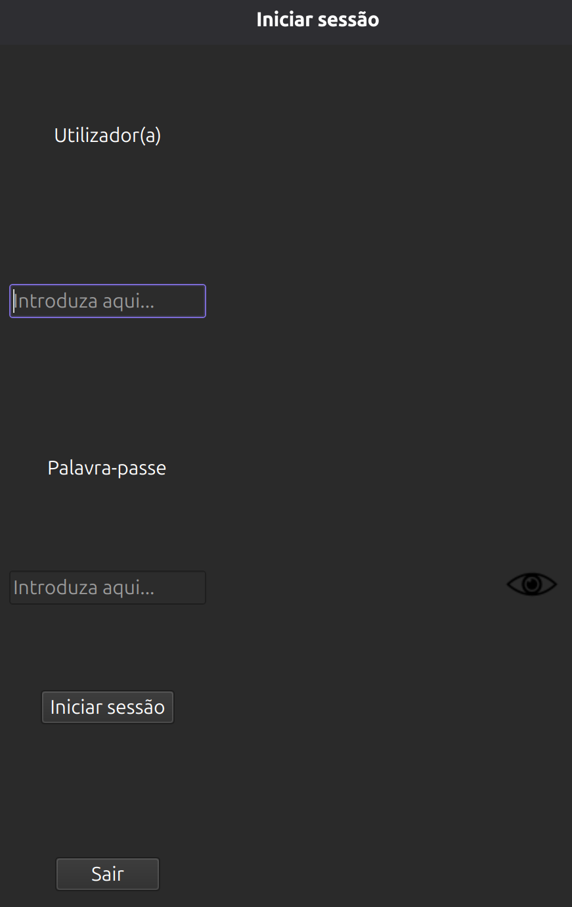
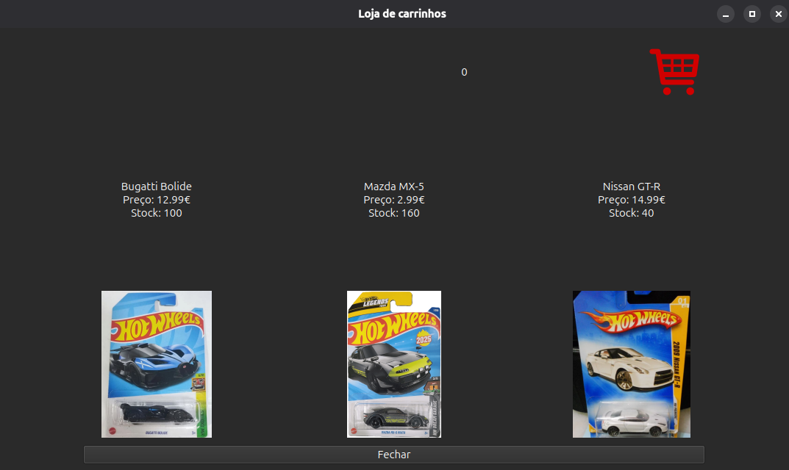
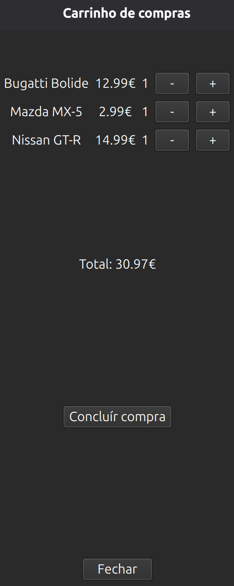
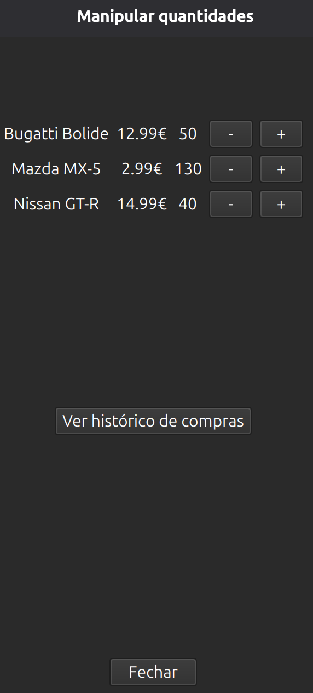

  # Loja de Carrinhos v2 🏎️

  Aplicação desenvolvida em **Python 3.14.5**, com interface gráfica em **PySide6**, compilada com **PyInstaller**, utilizando **SQLite3** para persistência de dados e **PBKDF2** para hashing seguro de passwords.

  A arquitetura segue o padrão **MVC**, garantindo organização, modularidade e facilidade de manutenção.

  ## Funcionalidades ✨

  - Comprar, vender e manipular quantidades de carrinhos.
  - Base de dados que armazena:
    - informações dos carrinhos;
    - credenciais hasheadas de utilizadores e administradores.
  - Geração automática de relatórios de vendas em **CSV**.
  - Efeitos sonoros e imagens para uma experiência mais envolvente.
  - Scripts de compilação para **Linux**, **macOS** e **Windows**.

  ---

  ## Como executar ⚙️

  ### 1. Instalar o uv e preparar o ambiente virtual 🔧:

  O uv é um gestor de ambientes e dependências extremamente rápido.  
  Instale-o seguindo o método oficial:

  ```bash
  curl -LsSf https://astral.sh/uv/install.sh | sh
  ```

  Depois, instale as dependências do projeto:

  ```bash
  uv sync
  ```

  ### 2. Ativar o ambiente virtual 🔒:
  ```bash
  source .venv/bin/activate
  ```

  ### 3. Iniciar o programa ▶️:
  ```bash
  python main.py
  ```

  ---

  ## Como compilar 🔨

  Cada sistema operativo possui um script próprio dentro da pasta builds/.

  ### Linux:
  ```bash
  cd builds/linux
  chmod +x build.sh
  ./build.sh
  ```

  ### macOS:
  ```bash
  cd builds/macos
  chmod +x build.sh
  ./build.sh
  ```

  ### Windows:
  ```powershell
  cd builds/windows
  .\build.ps1
  ```

  ---

  ## Estrutura do projecto 📁

  Veja a estrutura completa do projecto em [PROJECT_STRUCTURE](PROJECT_STRUCTURE.md)

  ---

  ## Capturas de ecrã 📷

  ### Iniciar sessão 🔽
  <p align="center">
    
  </p>

  ### Loja de carrinhos 🏪
  <p align="center">
    
  </p>

  ### Carrinho de compras 🛒
  <p align="center">
    
  </p>

  ### Manipular quantidades 📦
  <p align="center">
    
  </p>

  ---

  ## Segredos do programa 🤫

  * Se segurar a tecla **SHIFT** e clicar na imagem do carrinho, no botão **+** ou no botão **-**, a quantidade desse carrinho irá ser alterada em **10** unidades. <br />
  * Se segurar a tecla **CTRL** e clicar na imagem do carrinho, no botão **+** ou no botão **-**, a quantidade desse carrinho irá ser alterada em **5** unidades. <br />
  * Se só **clicar** na imagem do carrinho, no botão **+** ou no botão **-**, a quantidade desse carrinho irá ser alterada em **1** unidade.